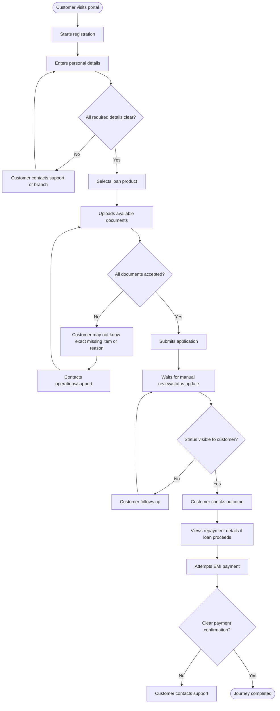

# AS-IS Workflow (Assumed Current State)

This is a hypothesized baseline for the fictional case study. A real BA would validate it through interviews, observation and document review.

```mermaid
flowchart TD
 A([Customer visits portal]) --> B[Starts registration]
 B --> C[Enters personal details]
 C --> D{All required details clear?}
 D -- No --> E[Customer contacts support or branch]
 E --> C
 D -- Yes --> F[Selects loan product]
 F --> G[Uploads available documents]
 G --> H{All documents accepted?}
 H -- No --> I[Customer may not know exact missing item or reason]
 I --> J[Contacts operations/support]
 J --> G
 H -- Yes --> K[Submits application]
 K --> L[Waits for manual review/status update]
 L --> M{Status visible to customer?}
 M -- No --> N[Customer follows up]
 N --> L
 M -- Yes --> O[Customer checks outcome]
 O --> P[Views repayment details if loan proceeds]
 P --> Q[Attempts EMI payment]
 Q --> R{Clear payment confirmation?}
 R -- No --> S[Customer contacts support]
 R -- Yes --> T([Journey completed])
```
